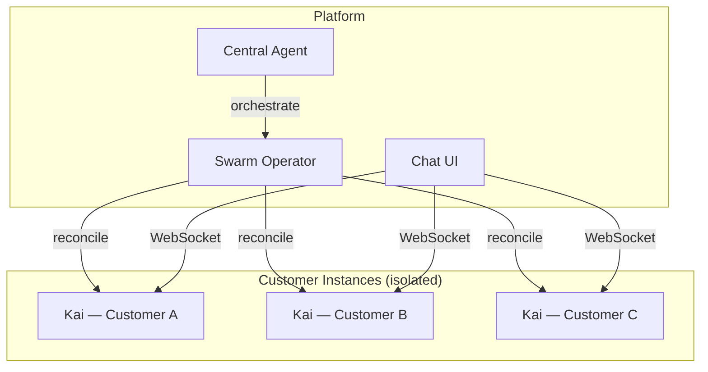

# OpenClaw Swarm

Multi-instance deployment platform for [OpenClaw](https://docs.openclaw.ai) AI agents. Deploy isolated, customer-facing AI assistants on Kubernetes — each with its own persona, data, and network isolation.

## Architecture



Each customer gets:
- **Isolated OpenClaw instance** in its own pod with PVC
- **Own SOUL.md** defining the agent's persona and scope
- **Network isolation** — customer pods cannot reach each other
- **Web Chat + Telegram** — customer-facing channels
- **LLM via OpenRouter** — configurable model per instance (free tier available)

## Quick Start

```bash
# Prerequisites: Docker, k3d, kubectl, Go 1.22+, Node 22+

# Clone
git clone https://github.com/RaaSaaR-org/openclaw-swarm.git
cd openclaw-swarm

# Set up local K8s cluster
make dev-cluster

# Install the operator CRD
make install-crds

# Run the operator locally
make dev-operator
# In another terminal:

# Create a customer instance
cat <<YAML | kubectl apply -f -
apiVersion: swarm.emai.io/v1alpha1
kind: KaiInstance
metadata:
  name: kai-demo
  namespace: default
spec:
  customerName: "Demo Customer"
  projectName: "Demo Project"
  gatewayAuth:
    mode: "token"
    token: "demo-token"
YAML

# Check it's running
kubectl get kaiinstances
```

### Docker Compose (alternative, no K8s)

```bash
cp docker/.env.example docker/.env
# Edit .env: add OPENROUTER_API_KEY (free at openrouter.ai)
cd docker && docker compose up -d
```

## Components

| Component | What | Stack |
|-----------|------|-------|
| [**Swarm Operator**](operator/) | K8s operator — reconciles `KaiInstance` CRDs into Deployments, Services, PVCs, NetworkPolicies, Ingresses | Go, Kubebuilder |
| [**Customer Chat**](web/customer-chat/) | Web chat frontend with Ed25519 device auth | Vite, TypeScript |
| [**Agent Templates**](agents/) | Identity files (SOUL.md, AGENTS.md, HEARTBEAT.md) and OpenClaw config templates | Markdown, JSON |
| [**swarm-ctl**](scripts/swarm-ctl.sh) | CLI wrapper for managing KaiInstance resources | Bash |

## KaiInstance CRD

The operator watches `KaiInstance` custom resources and creates the full stack for each customer:

```yaml
apiVersion: swarm.emai.io/v1alpha1
kind: KaiInstance
metadata:
  name: kai-acme
spec:
  customerName: "Acme GmbH"
  projectName: "Robot Integration"
  customerSlug: "acme"           # optional, auto-derived
  model: "openrouter/..."        # optional, has default
  gatewayAuth:
    mode: "token"
    token: "kai-acme-secret"
  telegram:                      # optional
    botTokenSecretRef: "kai-acme-telegram"
  suspended: false               # scale to 0 without deleting data
  resources:                     # optional, has defaults
    requests:
      memory: "1Gi"
    limits:
      memory: "2Gi"
```

**Creates:** ConfigMap (identity files) → PVC (agent state) → Deployment (OpenClaw pod) → Service → NetworkPolicy (isolation) → Ingress (external WebSocket)

## Agent Workspace

Each agent gets a workspace with these files:

| File | Purpose | Customizable |
|------|---------|-------------|
| `SOUL.md` | Agent persona, tone, project context | Per-customer |
| `AGENTS.md` | Operating instructions, memory protocol | Template default |
| `TOOLS.md` | Environment notes, workspace paths | Per-customer |
| `HEARTBEAT.md` | Scheduled periodic tasks | Per-customer |
| `skills/mc/SKILL.md` | MissionControl CLI integration | Template default |

Identity files on the PVC are **not overwritten** on pod restart — custom overrides from provisioning scripts are preserved.

## Development

```bash
make help              # Show all targets
make test              # Run all tests
make lint              # Run linters
make build             # Build all images
make build-operator-arm64  # ARM64 for cloud deployment
```

See [CONTRIBUTING.md](CONTRIBUTING.md) for the full setup guide.

## Directory Layout

```
swarm/
├── operator/               # K8s Operator (Go/Kubebuilder)
│   ├── api/v1alpha1/       # KaiInstance CRD types
│   ├── internal/controller/# Reconciliation + templates
│   └── config/             # CRD, RBAC, manager manifests
├── web/customer-chat/      # Chat UI (Vite + TypeScript)
├── kubernetes/             # Base K8s manifests (central agent, RBAC)
├── agents/
│   ├── central/            # Central agent defaults
│   └── customer-template/  # Legacy templates (Docker Compose)
├── docker/                 # Docker Compose for local dev
├── scripts/                # swarm-ctl, provisioning, health-check
├── terraform/              # Hetzner Cloud IaC
└── docs/                   # Deployment guide, onboarding
```

## Private Config Overlay

For production deployments, create a sibling `swarm-config/` repo with:
- Customer identity files (SOUL.md, USER.md per customer)
- K8s manifest overlays (sidecars, ingress, CronJobs)
- Environment secrets and deploy scripts
- KaiInstance CRDs per customer

The deploy script applies public base manifests first, then private overlays on top.

## License

[Apache 2.0](LICENSE)
