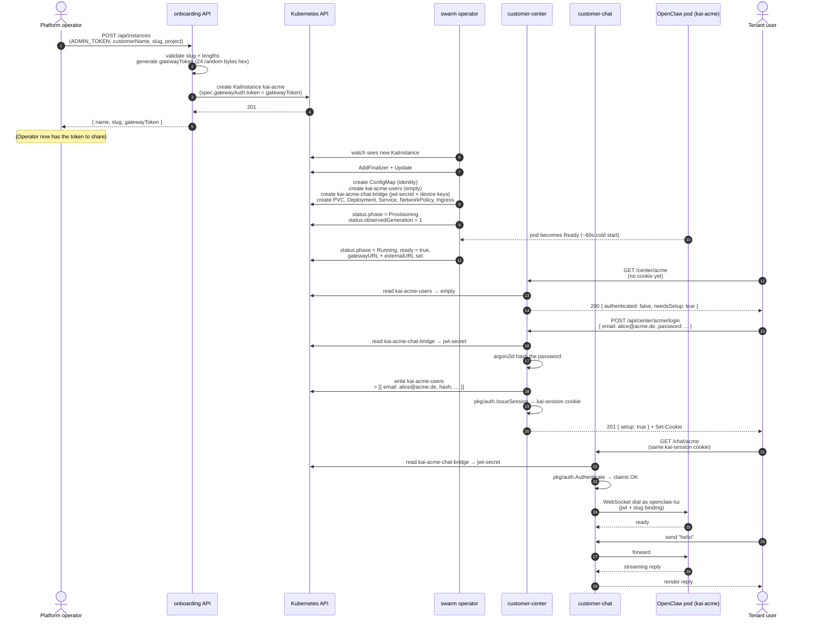

# Swarm Architecture

OpenClaw Swarm runs **one OpenClaw agent pod per tenant** on Kubernetes, fronted by a small set of web apps that handle user login, provisioning, status, and platform ops. This document explains what each piece is, who talks to it, what it reads and writes in the cluster, and how a new tenant flows through the system end-to-end.

If you're new to the repo, read this **before** `deployment-guide.md` — it answers "what are all these apps for" so the deploy steps make sense.

---

## The pieces

| Component | Type | Audience | Auth | What it does |
|---|---|---|---|---|
| **Operator** | Go controller (Kubebuilder) | (no humans) | K8s RBAC | Reconciles `KaiInstance` CRs into Deployments / Services / PVCs / Secrets / NetworkPolicies / Ingresses. The single source of truth for "what does a tenant deployment look like." |
| **Customer Chat** (`web/customer-chat/`) | Vite SPA + Go server | End user | Per-tenant JWT cookie | Tenant-facing chat UI. Logs the user in against a per-tenant users Secret, then bridges WebSocket traffic to the OpenClaw pod's gateway. |
| **Customer Center** (`web/customer-center/`) | Vite SPA + Go server | Tenant admin | Per-tenant JWT cookie + bootstrap-admin first-login | Tenant dashboard: manage Team (add/remove users + reset passwords), see briefings, see profile (scope, heartbeat). Same JWT cookie as customer-chat — login on one is honored by the other when they share an origin. |
| **Admin Console** (`web/admin-console/`) | Vite SPA + Go server | Platform operator | Global `ADMIN_TOKEN` (Bearer) | Lists every `KaiInstance` in the namespace; suspend / resume; inspect raw spec. Cluster-wide, not per-tenant. |
| **Onboarding API** (`web/onboarding/`) | Vite SPA + Go server | Platform operator (today) | Global `ADMIN_TOKEN` (Bearer) | Provisions new tenants: validates input, creates the `KaiInstance` CR, generates a gateway token, returns it for sharing. Today operator-only; the SaaS direction (`.mc/` task TASK-013) opens this up to public signup. |
| **Status Page** (`web/status-page/`) | Vite SPA + Go server | Anyone with the per-tenant token | Per-tenant `gatewayAuth.token` (Bearer or `?token=`) | Read-only public-friendly status for one tenant: `online` / `setting-up` / `maintenance` / `issue` / `unknown`. Same shape on auth fail / not found / wrong token, so probing slugs reveals nothing. |
| **OpenClaw pod** (`ghcr.io/openclaw/openclaw:latest`) | Node.js (third-party) | (no direct humans — through chat) | Gateway token + control-UI bypass for customer-chat | The actual AI agent. One pod per tenant. Reads its workspace from the per-tenant ConfigMap and PVC. |

The **shared library `pkg/auth/`** holds JWT + argon2id helpers used by customer-chat and customer-center. It exists so the two services can't drift on auth semantics — see TASK-004 for the rationale.

---

## Two auth models

The single biggest "why is this confusing" answer: there are **two separate auth models** in the platform. They never mix.

| Model | Used by | Secret material | Lifetime | Scope |
|---|---|---|---|---|
| **Platform token** (`ADMIN_TOKEN`) | admin-console, onboarding | One env var on the Deployment | Until the env var rotates | Whole namespace; whoever has it can list/provision/suspend any tenant |
| **Per-tenant JWT** | customer-chat, customer-center | `kai-<slug>-chat-bridge` Secret (`jwt-secret` key, 32 random bytes generated by the operator) | 24h cookie TTL | One slug only — the JWT carries `slug` in its claims and is rejected against any other slug |
| **Per-tenant gateway token** | status-page | `KaiInstance.spec.gatewayAuth.token` (set at provision time) | Until the spec is mutated | One slug only |

- The operator generates the per-tenant JWT secret on first reconcile and stores it in `kai-<slug>-chat-bridge` (along with the chat bridge's Ed25519 device keypair). It is **not rotated** automatically; rotation today means deleting the Secret and bouncing the chat-bridge connections.
- The bootstrap-admin flow lives in customer-center: when `kai-<slug>-users` is empty, the first POST to `/api/center/<slug>/login` is treated as initial setup — the submitter's email + password becomes the admin record. After that, normal login + Team-page-driven user CRUD.
- Logout is **server-side enforced**: every JWT carries a per-issue `jti` (16 hex chars). The logout handler records the `jti` in `kai-<slug>-chat-bridge.revoked-jtis` (JSON array, capped at 1000 entries, expired entries pruned on read). On the next request, `auth.Authenticate` succeeds but the server checks the `jti` against the revocation list and rejects revoked tokens. Implementation lives in `pkg/authk8s` (the K8s-Secret-backed `Revoker`) so `pkg/auth` stays dep-light. Emergency "log out everyone for tenant X" remains a one-line Secret patch that bumps `jwt-secret`, invalidating every outstanding token at the signature level.

---

## What each app reads and writes

| App | Reads | Writes | RBAC needed |
|---|---|---|---|
| Operator | `KaiInstance` CRs (watch); ConfigMap/PVC/Deployment/Service/NetworkPolicy/Ingress to detect drift; `Secret` to detect existence | All child resources of every `KaiInstance` (cascade via ownerReferences); `kai-<slug>-chat-bridge` and `kai-<slug>-users` Secrets (initial create only — never overwritten) | Cluster-wide on `kaiinstances` + child types |
| Customer Chat | `kai-<slug>-chat-bridge` (jwt-secret + device keys for the WS handshake); `kai-<slug>-users` (verify password) | (none — read-only against K8s) | `secrets[get,list]` in the namespace |
| Customer Center | `kai-<slug>-chat-bridge` (jwt-secret); `kai-<slug>-users`; tenant-profile ConfigMaps (`kai-<slug>-briefings`, scope, heartbeat) | `kai-<slug>-users` (add/remove users, reset password) | `secrets[get,list,update]` + `configmaps[get,list]` in the namespace |
| Admin Console | All `KaiInstance` CRs (list, get) | `KaiInstance.spec.suspended` (patch via suspend/resume) | `kaiinstances[get,list,patch]` in the namespace |
| Onboarding | (none) | `KaiInstance` (create) | `kaiinstances[create]` in the namespace |
| Status Page | `KaiInstance` (get one by slug); validates the request token against `spec.gatewayAuth.token` | (none) | `kaiinstances[get]` in the namespace |

The customer-chat **WebSocket bridge** then dials the per-tenant OpenClaw gateway over the in-cluster Service `kai-<slug>:18789`, posing as `openclaw-tui` (the controlUi-bypass client ID) so the gateway accepts it without device pairing. That's a swarm-internal contract; the OpenClaw side documents it under "control UI clients" in the gateway docs.

---

## Sequence: new tenant from zero to working chat

A few things to notice from the diagram:
- **Two writers to `kai-<slug>-users`**: the operator creates it empty; customer-center is the only writer after that. Customer-chat is read-only.
- **The gateway token is set once** at provision time. It's stored on `KaiInstance.spec.gatewayAuth.token` and reused by status-page. Rotating it requires a `kubectl patch` on the spec.
- **The JWT secret is independent of the gateway token.** Customer-chat / customer-center authenticate users with the JWT secret; the OpenClaw gateway authenticates *services* with the gateway token. They never overlap.

---

## swarm vs. swarm-config

The public **`swarm`** repo (this one) ships the platform: operator, web apps, shared libs, K8s base manifests, agent templates with `{{PLACEHOLDERS}}`. It contains **no real tenant data and no deployment-specific secrets**.

A sibling **private** repo (today: `swarm-config`; the `.mc/` SaaS-direction work tracks renaming this and creating a separate `swarm-cloud` for hosted SaaS deployment — see TASK-023) carries the operator-of-the-platform's overlay:

- Per-tenant `KaiInstance` manifests (with concrete customer names, slugs, gateway tokens)
- Per-tenant `SOUL.md` / `USER.md` / `HEARTBEAT.md` overrides — the customer-template in `agents/` is the default; the private overlay overrides per-tenant
- Production secrets (`.env`, OpenRouter keys, telegram bot tokens). The OpenRouter key can be wired two ways: (1) per-tenant `kai-<slug>-openrouter` Secret (legacy / BYOK-shaped, the public-repo default) or (2) one shared **pooled** Secret in the operator namespace, selected by setting `SWARM_POOLED_OPENROUTER_SECRET` on the operator Deployment (PROP-002 — pooled-only is the SaaS direction; one platform key, all tenants share it, per-tier daily caps land in a future phase of TASK-019).
- K8s overlay with the `ADMIN_TOKEN` and ingress hostnames for the public surfaces
- Deploy scripts (`deploy.sh`, `onboard.sh`)

The seam is intentional: anyone can fork `swarm` and run their own platform with their own private overlay. EmAI's overlay is private; another organisation's would be too.

> **Terminology note:** in the public `swarm` repo, prefer **tenant** / **user** / **workspace** over "customer" — see TASK-024 for the rename plan. Existing identifiers (the `customer-chat` directory, `KaiInstance.spec.customerSlug`, the `emai.io/customer` label) still use the old name; they're scheduled for migration alongside the v1alpha1→v1alpha2 CRD bump.

---

## Where to look next

- **Provisioning a tenant by hand** → `scripts/swarm-ctl.sh` (CLI) + `scripts/swarm-ctl.sh info <slug>` for the post-provision URL/token summary
- **Health-checking the platform** → `scripts/health-check-k8s.sh` (walks every `KaiInstance`, reports OK / DEGRADED / SUSPENDED / PROVISIONING / FAILED / DOWN, JSON output for monitoring)
- **Building locally** → `CONTRIBUTING.md`
- **Deploying to your own cluster** → `docs/deployment-guide.md`
- **Onboarding a tenant** → `docs/customer-onboarding.md`
- **Where this is going** → `.mc/tasks/` — the SaaS direction (signup, billing, multi-app catalog, marketing) is tracked there
